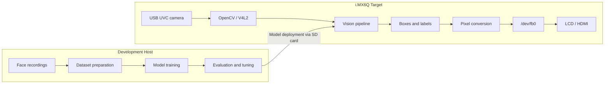
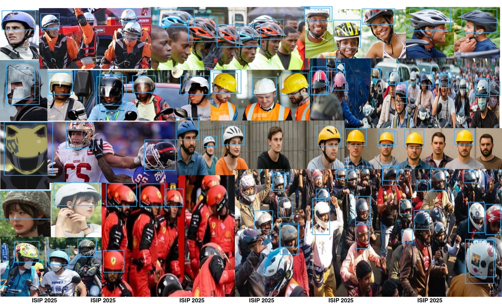

# Embedded Vision Pipeline on NXP i.MX6Q

**Development period:** September–December 2025

A CPU-only embedded computer-vision system for the Embedsky E9V3 development
board, built around an NXP i.MX6Q ARM processor.

The project connects USB camera capture, OpenCV image processing, face
recognition, object detection, and direct Linux framebuffer rendering. Target
applications are cross-compiled for ARMv7 and operate without X11, Wayland, or
hardware DNN acceleration.


## Highlights

- Cross-compiled OpenCV 3.4.7 and `opencv_contrib` for ARMv7 Linux.
- Captured live video from a USB UVC camera through V4L2.
- Rendered images directly to `/dev/fb0` without a desktop display server.
- Supported both a 16-bit LCD framebuffer and 32-bit HDMI output.
- Implemented aspect-ratio-preserving scaling, centering, and letterboxing.
- Built an LBPH face-recognition pipeline from 3,194 extracted face images.
- Integrated CPU-based YOLOv3 helmet detection for high-resolution photos.
- Trained a custom 30-class YOLOv3 detector on a 3,638-image Darknet dataset.
- Deployed executables and model assets to an offline target through removable
  storage and a serial console.

## System Architecture



The host and target are intentionally separated. Dataset preparation, model
training, and parameter tuning run on a development machine. Camera capture,
vision processing, and display integration are implemented in C++ for the ARM
target.

## Platform

| Component | Configuration |
|---|---|
| Development board | Embedsky E9V3 |
| SoC | NXP i.MX6Q, quad-core ARM Cortex-A9 at 1 GHz |
| Memory | 1 GB RAM |
| Operating system | Embedded Linux 4.1, booted from eMMC |
| Camera | USB UVC webcam through V4L2 (`/dev/video2`) |
| Displays | 7-inch LCD and HDMI 1080p output |
| Console | RS-232 at 115200 baud |
| Cross compiler | Linaro GCC 5.3, `arm-linux-gnueabihf` |
| Computer vision | OpenCV 3.4.7 with `opencv_contrib` |
| Target acceleration | CPU inference only |

## Vision Pipelines

### Direct Framebuffer Rendering

The display path writes image data directly to the Linux framebuffer instead
of relying on `cv::imshow()` or a graphical desktop environment.

The implementation covers:

- BGR to BGR565 conversion for the 16-bit LCD.
- BGR to BGRA conversion for 32-bit HDMI output.
- Aspect-ratio-preserving resize calculations.
- Horizontal and vertical centering.
- Black letterbox and pillarbox regions.
- Live USB camera display and video recording.
- Non-overwriting screenshot sessions on the SD card.
- Keyboard-controlled horizontal scrolling.

Framebuffer geometry is queried from the device with `ioctl()`:

```cpp
ioctl(fbfd, FBIOGET_VSCREENINFO, &var_info);
ioctl(fbfd, FBIOGET_FSCREENINFO, &fix_info);
```

The fixed framebuffer information provides the actual `line_length`. This is
important because device drivers may pad rows for alignment, so the row stride
is not guaranteed to equal:

```text
screen width x bytes per pixel
```

The face-recognition renderer uses the driver-reported stride when composing
the display buffer.

### Face Recognition

The face-recognition pipeline combines Haar Cascade detection with Local Binary
Patterns Histograms (LBPH).

The host-side training workflow:

1. Extract frames from face recordings.
2. Detect the largest face in each frame.
3. Convert the detected region to grayscale.
4. Apply histogram equalization.
5. Resize the region to 200 x 200 pixels.
6. Train an LBPH recognizer.
7. Serialize the trained model for target deployment.

The dataset contains 3,194 extracted images from two subjects:

| Subject | Images |
|---|---:|
| Subject 1 | 1,932 |
| Subject 2 | 1,262 |
| **Total** | **3,194** |

On the board, camera frames go through the same detection and preprocessing
steps used by the training pipeline. Predictions within the selected LBPH
distance threshold are mapped to configured identities; all other predictions
are displayed as `Unknown`.

LBPH was selected as a constraint-driven alternative to a deep face model. It
provides a practical recognition path for the CPU-only Cortex-A9 platform and
keeps the inference pipeline compatible with OpenCV 3.4.7.

### Helmet Detection

Helmet detection uses OpenCV's DNN module with a single-class YOLOv3 model.
The Python reference implementation was used to iterate on input resolution,
confidence filtering, and non-maximum suppression before transferring the
pipeline to C++.

The inference path performs:

1. Image loading and blob construction.
2. YOLOv3 forward inference on the CPU.
3. Confidence filtering.
4. Non-maximum suppression.
5. Bounding-box and label rendering.
6. JPEG result export.
7. Direct framebuffer display.

The detector is intended for relatively small helmet regions in high-resolution
group images. A Haar Cascade approach was evaluated first, but produced too
many false positives in dense scenes.



### Custom 30-Class YOLOv3 Training

A separate custom YOLOv3 model was trained for multi-object recognition in
complex evaluation photos. The dataset was annotated and managed through
Roboflow, then exported in YOLO Darknet format.

| Dataset split | Images |
|---|---:|
| Training | 3,399 |
| Validation | 159 |
| Test | 80 |
| **Total** | **3,638** |

The export applies the following preprocessing and augmentation:

- EXIF auto-orientation.
- Resize to 416 x 416 pixels.
- Horizontal flipping.
- Random rotation between -15 and +15 degrees.
- Random brightness adjustment.
- Gaussian blur.
- Salt-and-pepper noise.

The detector contains 30 custom classes:

```text
Airplane, Apple, Baseball, Bottle, Cat, Controller, Dart, Dolphin,
Drink, Fork, Glass, Keyboard, Knife, Motorcycle, Mouse, Mug, Orange,
Pen, Pencil, Phone, Pigeon, Pizza, Poker card, Refrigerator, Scissors,
Sticky note, Tissue, USB drive, Umbrella, Zebra
```

Each YOLO output layer is configured for 30 classes:

```text
classes = 30
filters = 105
```

The filter count follows the standard YOLOv3 relationship:

```text
filters = (classes + 5) x 3
        = (30 + 5) x 3
        = 105
```

Trained checkpoints were evaluated through OpenCV's DNN module on the
development host. The repository keeps the network configuration, class list,
and inference utilities while excluding the large generated weight files.

## Engineering Challenges

### Cross-Compiling OpenCV

OpenCV 3.4.7 was built from source with the ARM cross compiler. Tests, Python
bindings, and unused backends were disabled, while V4L2, `opencv_world`, and the
required vision modules were retained.

The DNN-enabled build required Qt support to be disabled. This did not affect
the applications because display output was handled through `/dev/fb0`.

Additional `-rpath-link` options were needed to resolve the transitive
dependencies of `libopencv_world.so` inside the target sysroot.

### Framebuffer Stride and Pixel Format

An early display implementation calculated each row offset from the virtual
width and bits per pixel. That assumption can produce distorted output when the
driver adds row padding.

The corrected rendering path uses:

```cpp
const uint32_t line_pitch = fix_info.line_length;
```

It also selects the OpenCV color conversion according to the framebuffer depth,
allowing the same rendering path to support the LCD and HDMI configurations.

### Reducing Display I/O

Writing each scanline separately creates hundreds or thousands of seek/write
operations per frame. The optimized renderer composes the complete output in a
userspace buffer and flushes it to the framebuffer with one write operation.

Clearing that buffer also creates the black letterbox regions without issuing
additional writes for each border.

### Non-Blocking Terminal Controls

Blocking keyboard input would stop the camera loop. Terminal input is therefore
configured with `termios` and polled with `select()`.

This enables controls such as:

| Key | Action |
|---|---|
| `C` | Capture a screenshot |
| `J` | Scroll left |
| `L` | Scroll right |
| `Q` | Exit |

### Offline Deployment

The target board was operated without network access. Executables, shared
libraries, model files, and test images were transferred through removable
storage or the serial console.

OpenCV was not installed system-wide on the target, so applications were
launched with a local runtime library path:

```bash
LD_LIBRARY_PATH=. ./application
```

## Repository Structure

```text
.
├── host/
│   ├── dataset/                 # Video-to-frame dataset preparation
│   ├── training/                # LBPH training
│   ├── tuning/                  # Desktop evaluation and checkpoint checks
│   └── reference/               # Python YOLO reference implementations
├── target/
│   ├── 01-framebuffer-display/  # Image, camera, HDMI, and scrolling demos
│   ├── 02-face-recognition/     # Camera-based LBPH recognition
│   ├── 03-helmet-detection/     # YOLOv3 helmet detection and display
│   └── 04-object-detection/     # Custom YOLOv3 model configuration
└── docs/
    ├── images/                  # Detection results
    └── toolchain-setup.md       # Cross-compilation and deployment notes
```

## Host Tools

| Tool | Purpose |
|---|---|
| `host/dataset/extract_frames.py` | Extract training frames from face recordings |
| `host/training/train_lbph.py` | Preprocess faces and train the LBPH model |
| `host/tuning/test_on_desktop.py` | Evaluate recognition behavior and threshold selection |
| `host/tuning/inspect_weights.py` | Check YOLO checkpoints for NaN or all-zero parameters |
| `host/reference/detect_helmet.py` | Tune the helmet-detection pipeline on the host |
| `host/reference/detect_photo.py` | Evaluate the custom 30-class YOLOv3 model |

The Python tools require OpenCV 4.x on the development host. Face-recognition
training additionally requires the contrib package that provides `cv2.face`.

## Cross-Compilation

A representative target build command is:

```bash
arm-linux-gnueabihf-g++ -std=gnu++11 source.cpp -o application \
  -I /opt/EmbedSky/gcc-linaro-5.3-2016.02-x86_64_arm-linux-gnueabihf/include/ \
  -I /usr/local/arm-opencv/install/include/ \
  -L /usr/local/arm-opencv/install/lib/ \
  -Wl,-rpath-link=/opt/EmbedSky/gcc-linaro-5.3-2016.02-x86_64_arm-linux-gnueabihf/arm-linux-gnueabihf/libc/lib/ \
  -Wl,-rpath-link=/opt/EmbedSky/gcc-linaro-5.3-2016.02-x86_64_arm-linux-gnueabihf/qt5.5/rootfs_imx6q_V3_qt5.5_env/lib/ \
  -Wl,-rpath-link=/opt/EmbedSky/gcc-linaro-5.3-2016.02-x86_64_arm-linux-gnueabihf/qt5.5/rootfs_imx6q_V3_qt5.5_env/qt5.5_env/lib/ \
  -Wl,-rpath-link=/opt/EmbedSky/gcc-linaro-5.3-2016.02-x86_64_arm-linux-gnueabihf/qt5.5/rootfs_imx6q_V3_qt5.5_env/usr/lib/ \
  -lpthread -lopencv_world
```

The full OpenCV configuration and target-specific notes are documented in
[`docs/toolchain-setup.md`](docs/toolchain-setup.md).

## Deployment

Copy the application and its required assets to the target storage:

```text
application
libopencv_world.so.3.4
model configuration
model weights
class-name file
input assets
```

Then launch it from the serial console:

```bash
LD_LIBRARY_PATH=. ./application
```

## Model Artifacts

Large generated models are intentionally excluded from Git:

| Pipeline | Generated artifact |
|---|---|
| Face recognition | `trainer3.yml` |
| Helmet detection | `yolov3-obj_2400.weights` |
| Custom object detection | `yolov3_custom_10000_v1.weights` and training checkpoints |

Training data, camera recordings, virtual environments, compiled binaries, and
shared libraries are also excluded. The repository retains the source code,
network definitions, class metadata, and documentation used to explain the
host-to-target workflow.

## Documentation

- [`docs/toolchain-setup.md`](docs/toolchain-setup.md) documents the ARM OpenCV
  build, sysroot linking, framebuffer behavior, and deployment process.
- [`host/README.md`](host/README.md) describes the host-side model and dataset
  workflow.
- [`target/README.md`](target/README.md) describes the board-facing C++
  applications and hardware assumptions.

## Third-Party Components

This project uses:

- [OpenCV](https://opencv.org/) and `opencv_contrib`.
- Linux framebuffer and V4L2 interfaces.
- A pretrained helmet detector based on
  [BlcaKHat/yolov3-Helmet-Detection](https://github.com/BlcaKHat/yolov3-Helmet-Detection).
- A custom object-detection dataset exported through
  [Roboflow](https://universe.roboflow.com/embeded-system-final/lab_final) under
  CC BY 4.0.

Third-party code, models, and datasets remain subject to their respective
licenses.
